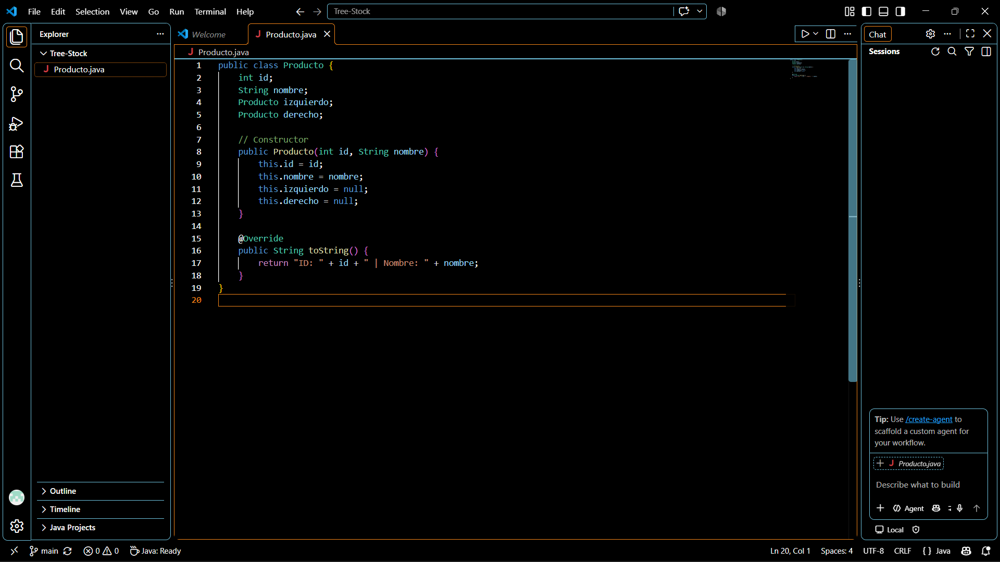
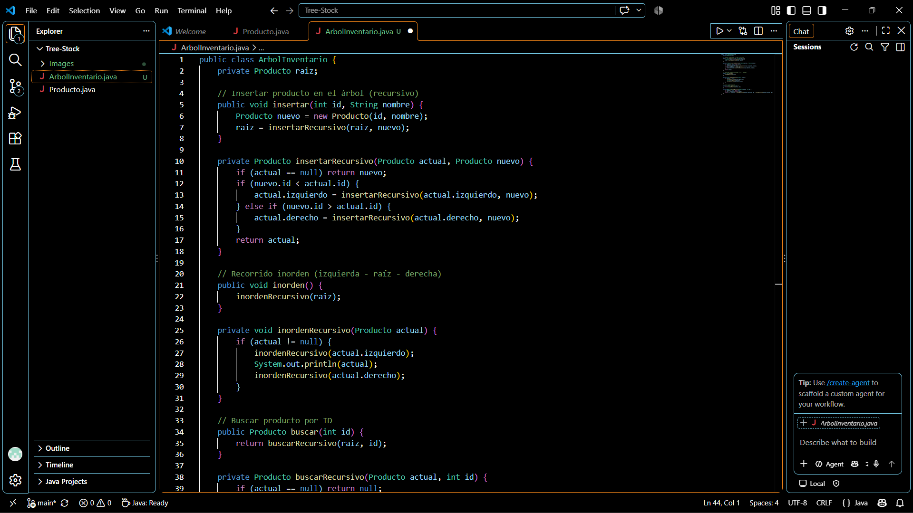
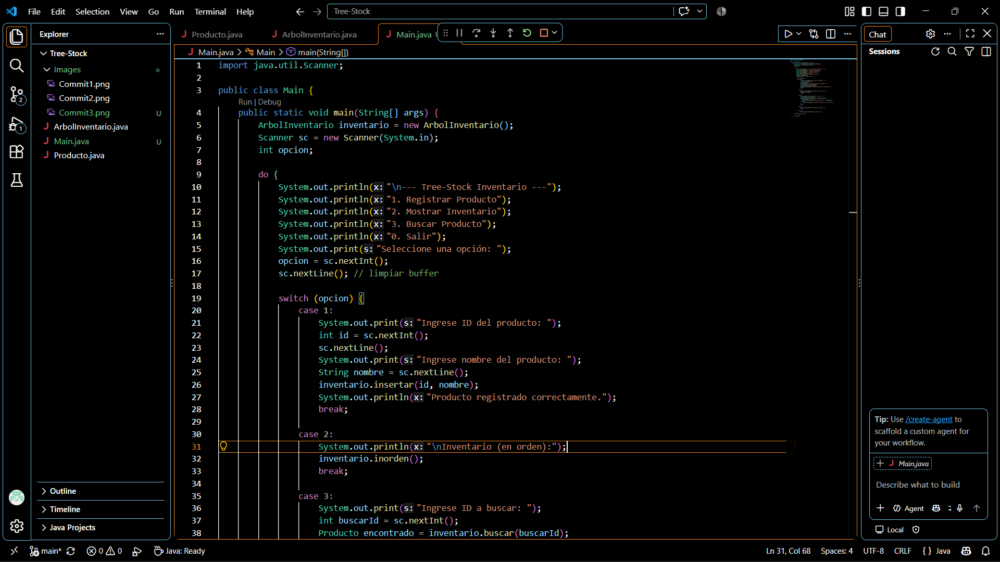
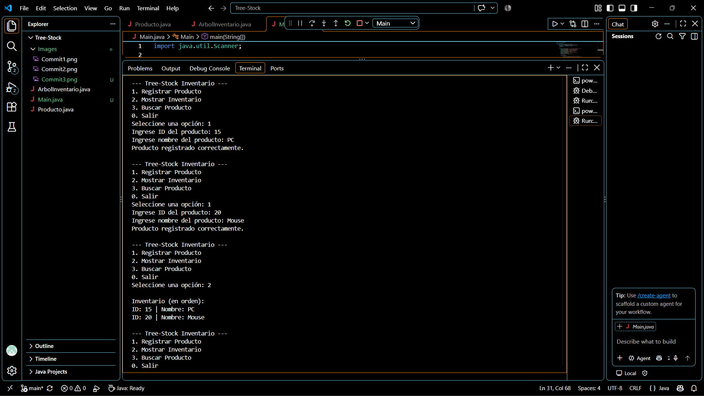
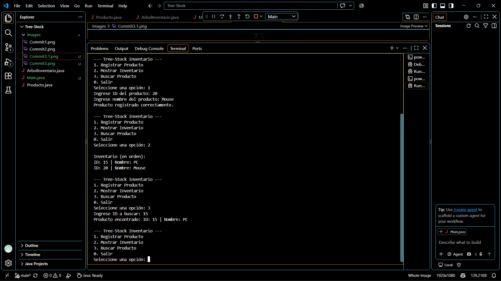

# 📦 S30 - EA3. Actividad Final  
## Manipulación de Árboles en Java (Tree-Stock)

# 🎯 Objetivo
Implementar un **árbol binario de búsqueda (ABB)** en Java para gestionar un inventario de productos, aplicando conceptos de **punteros** y **recursividad**.

---

# 📖 Teoría

# 🌳 Árbol Binario de Búsqueda (ABB)
Un ABB es una estructura jerárquica donde:
- Cada nodo tiene un **hijo izquierdo** con valores menores.
- Cada nodo tiene un **hijo derecho** con valores mayores.
- La raíz es el punto de inicio y desde allí se organizan los datos.

# 🔄 Recursividad
La recursividad permite que un método se llame a sí mismo para resolver problemas más pequeños:
- **Insertar:** compara el ID y decide si va a la izquierda o derecha.
- **Buscar:** recorre el árbol aplicando la misma lógica en cada nodo.
- **Recorrido inorden:** lista los productos ordenados por ID.

# 🖼️ Evidencias (Capturas)

### Commit 1: Clase Producto

### Commit 2: Clase ArbolInventario

### Commit 3: Menú interactivo

### Commit 3.1: Ejecución

### Commit 3.2: Ejecución

# 🎥 Video de sustentación

https://drive.google.com/file/d/1FSRJ19Ct4mhA2nRdONelfkpEWWTSa8oE/view?usp=sharing  